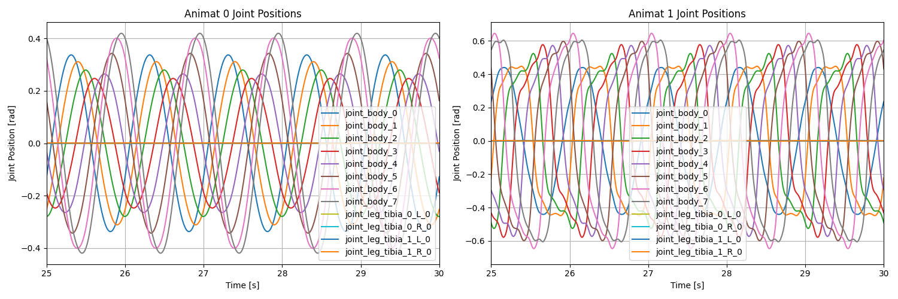
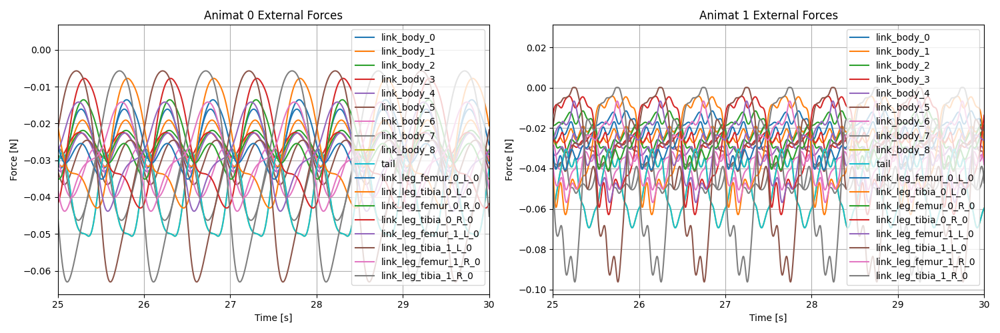

# implicit_ekeberg

Tools for running Ekeberg-style muscle actuation in MuJoCo, built on top of the FARMS ecosystem (https://github.com/farmsim). The repository bundles the required FARMS submodules plus example controllers and analysis scripts for Salamandra Robotica swimmers.

## Project layout
- **src/ekeberg.py**: Extension that integrates the Ekeberg muscle model into the FARMS simulation. To use it, your animat configuration must include an `extensions` section with two required attributes:
    - `loader`: Points to the Ekeberg extension class (`farms_ekeberg.src.ekeberg.EkebergMuscleController`)
    - `config`: Nested dictionary containing:
        - `load_controller` (required): Path to your controller class that generates muscle activation signals. See more details in the examples in ```src/network.py```
        - `muscle_pars` (required): Either a list of Ekeberg muscle parameters or a path to a CSV file containing them (see the two different animat examples)
        - Additional optional parameters (e.g., `freq`, `twl`, `amp`, `bias`, `method`) that will be passed to your controller's constructor

    Example configuration:
    ```yaml
    extensions:
    - loader: farms_ekeberg.src.ekeberg.EkebergMuscleController
        config:
            load_controller: farms_ekeberg.src.network.WaveController
            freq: 1.0
            twl: 1
            amp: 1
            bias: 0.0
            method: implicit
            muscle_pars: muscle_params.csv
    ```

- **src/network.py**: Use this as a template when creating custom controllers—your controller will receive the optional parameters from the config. A Hopf-based central pattern generator that drives rhythmic control signals for swimming is provided as an example.
Your controller class must:
    - Inherit from `network.NNController`
    - Implement a `step()` method that is called at every simulation iteration and returns the muscle difference and sum terms used in the Ekeberg muscle equations

- **demo/**: Demo comparing two controller families while sharing the Ekeberg muscle models. The folder ships configs, controller code, `run.sh` for quick experiments, output assets, and plotting utilities.

- **sdf/**: Contains the SDF files for the robot model and environment.

## Prerequisites

FARMS is split across three packages that must be installed before the extensions here can run:
1. [farms_core](https://github.com/farmsim/farms_core)
2. [farms_sim](https://github.com/farmsim/farms_sim)
3. [farms_mujoco](https://github.com/farmsim/farms_mujoco)

If you already have compatible releases of these packages in your environment you can skip the bundled setup and head straight to the project installation.

## Installing the bundled FARMS stack

The repo includes tested submodules to reproduce the published examples. Initialize the submodules and run the provided installer:

```bash
cd farms
git submodule update --init --recursive
python setup_farms.py
```

This step installs farms_core, farms_sim, and farms_mujoco into your current environment using the pinned commits referenced by this repository.

## Installing implicit_ekeberg

From the repository root, install the package in editable mode so scripts can import it directly:

```bash
pip install -e .
```

The editable install exposes the `farms_ekeberg` package (including the extensions under src/) to any Python session in the environment.

## Running the demo swimmers

Launch the paired Salamandra Robotica demo to compare the Hopf-oscillator controller with a sine-wave controller:

```bash
cd demo
sh run.sh
```

The script spawns two swimmers side by side, records their trajectories, and saves two outputsç: a `swimming_two_controllers.gif` plus an HDF5 log.

## Post-processing data

The folder includes `example_plot_results.py`, which reads the logged HDF5 file through the FARMS IO helpers and produces joint-angle and hydrodynamic-force plots in-place. Generated figures resemble:




Feel free to adapt the script for custom analyses or to plug the data into your own tooling.


