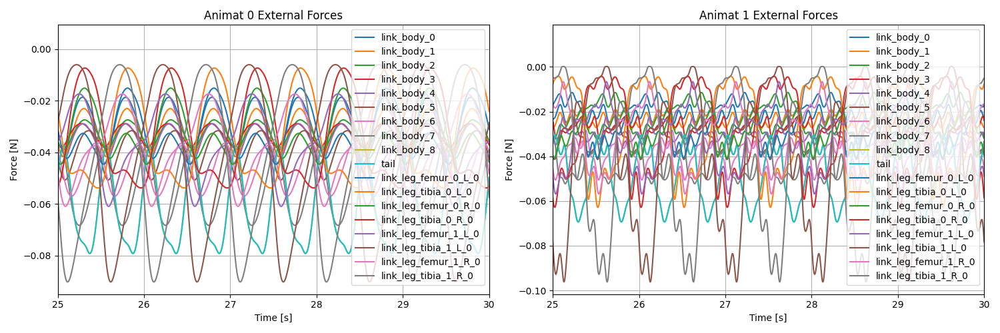

# implicit_ekeberg

This repository was created to enable simple Ekeberg muscle actuation in MuJoCo via FARMS (https://github.com/farmsim) extensions.

Installation:

1. Install farms_core, farms_sim, farms_mujoco is already installed in your system skip this point and go to point 2.
Otherwise, a tested version of farms was included and can be installed to reproduce the examples in this repositories.
To do this initialize the git submodules and running the setup script:

```bash
cd farms
git submodule update --init --recursive
python setup_farms.py
```

2. Install the current package in editable mode:

```bash
cd ..
pip install -e .
```

## Overview

## `src/`
- `ekeberg.py`: Provides the full implementation of the Ekeberg muscle model. This module is designed to be integrated as an extension within the Animat configuration, handling the muscle dynamics calculation during simulation steps. In the animat config you need to provide the controller file, the muscle parameters and optionally parameters used in your controller.

- `network.py`:Implements a Central Pattern Generator (CPG) network based on hopf oscillators. It defines the `Network` class which constructs the neural oscillator system and couples it to the simulation, managing the rhythmic output for locomotion.

## `multiple_swimmer/`
- Contains reproducible demos featuring paired Salamandra Robotica swimmers with different controller models and using the sama Ekeberg muscle models.
- Includes configuration, controller scripts, and `run.sh` to launch comparative controller runs.
- Outputs demo gifs such as `swimming_two_controllers.gif` for quick visualization.

Example:

```bash
cd multiple_swimmer
sh run.sh
```
In this example you will see two Salamandra Robotica robot swimmers run with two different controllers, an abstract oscillator decentralized controller and a sine wave controller.


An example of data postprocess is provided in ```example_plot_results.py```. This should save two plots for the joint angles and the external forces (hydrodynamic) in the ```multiple_swimmers``` folder similar to these:




